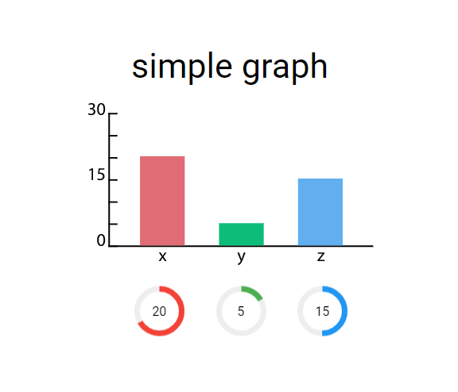

# lottie bar graph ([original request](https://github.com/airbnb/lottie-web/issues/1919))



## Online demo here

---

- [AEP file](./graph.aep)
- [Example lottie api registration]()
- [Issue reference for slider controls in lottie-api](https://github.com/bodymovin/lottie-api/issues/6)

---

## Notes on AEP:

The bars are created with simple rectangles with expressions attached to slider controls:

Size: 
```js
// [width, height]
[30, thisComp.layer("graphValues").effect("x")("Slider") * 3]
```

Position:
```js
// [xPosition, yPosition]
[0, thisComp.layer("graphValues").effect("x")("Slider") * -1.5]
```

Notice that the y position and height use the same value, but the yPosition is effectively bumped up by half the offset value (creating the illusion of the bar only growing from the bottom up).

--- 

## Requirements

- lottie-web
- lottie-api